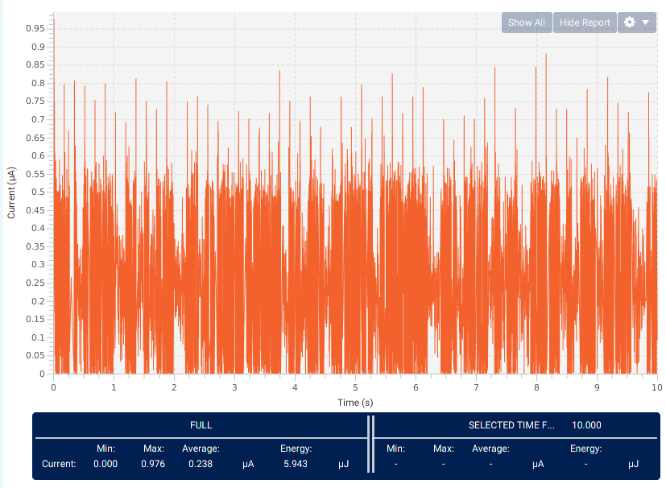
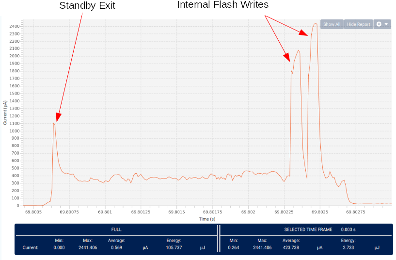
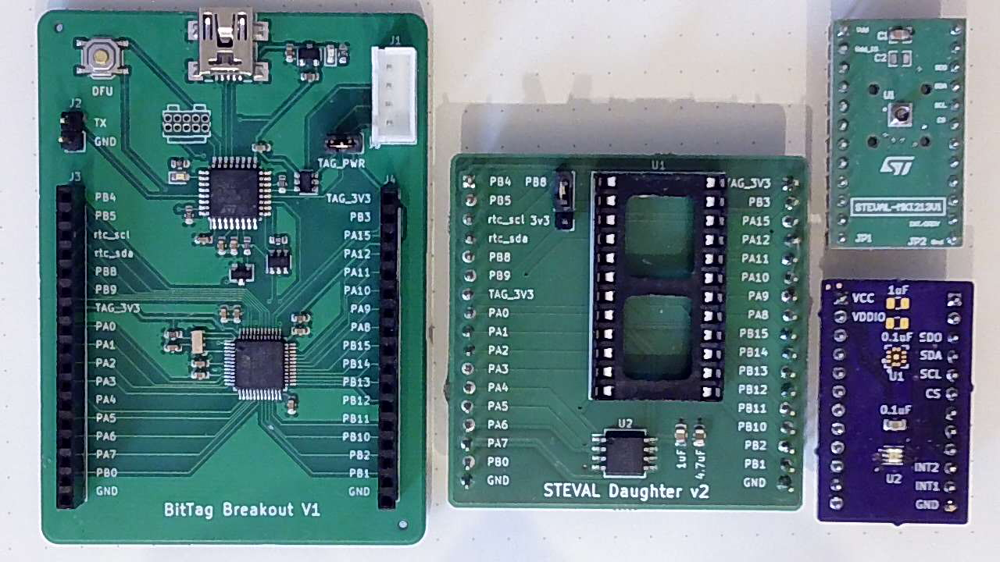

## Energy and Power

The dominant issue in developing long-life sub-gram tags is energy.  In the tags we describe,
all of the required energy must be carried in the form of batteries -- we do not consider
energy harvesting because of the additional complexity of power management circuitry, weight for
harvesting devices (e.g. solar cells), and, for solar, the likelihood that a solar cell will frequently be obscured.
Power delivery is a closely related issue; as we will show, many of the small batteries that are suitable
for our tags can deliver limited peak power which necessitates additional load  capacitors to deliver
high peak power for sensing and writing flash.  However, capacitors bring their own set of issues in the form of
leakage currents and board area.
In the following section we consider the energy and power requirements of small tags, techniques for minimizing
energy requirements, our approach to measuring energy and power requirements for real tags, and techniques
for estimating the energy requirements for a planned experiment.  Although much of our discussion is generalizable,
we necessarily focus upon the specific components used in our tags.

### Energy Sources

The primary energy source in our tags are batteries; however, in order to meet the peak
power requirements for writing flash memory and for some types of sensors (e.g. magnetometers),
it is necessary to supplement batteries with capacitors.

**Batteries** While there are many possible battery chemistries,
we have restricted our attention to rechargeable cells with voltages greater than 2 volts.  The most obvious choices are Lithium Polymer (Li-Po) and Lithium Manganese (Li-Mn).  The smallest
available Li-Po cells weigh approximately 0.4g and have relatively high peak power delivery (e.g. 10mA),
but they have several significant limitations -- it is difficult to obtain small quantities of well characterized sub-gram Li-Po batteries, the cells are physically fragile, and their peak voltage (4.2\si{\volt})
necessitates additional circuitry for power management.

In contrast, physically robust, well characterized Li-Mn batteries with 3.2V peak voltage are available
in a variety of sizes. Their primary limitation is the high internal impedance ($\Omega$) which severely restricts
peak power. By utilizing Li-Mn batteries, our tags can be configured at different weights depending upon the animal species being studied and the length of the planned experiments. For example, our partners studying
pine siskins and great tits require tags below 0.5g with 3 month lifetimes, which
we achieve utilizing MS518 batteries, while year long
studies with robins have been supported by 0.84g tags utilizing
MS920 batteries.

## Estimating Energy and Power

Accurate energy and power estimation for our tags requires active measurement of the various operating modes.  The datasheets for the various devices provide architectural guidance, but are not sufficiently accurate for predicting tag lifetime or for determining peak power requirements.   Furthermore, achieving the lowest energy utilization requires significant firmware tuning.  For example, we minimize the cost of waking up from processor Standby by optimizing the firmware initialization code.    Power measurement is an ongoing part of our software development process -- we frequently iterate on firmware design based upon power measurements. In addition, relatively small configuration errors (for example in processor pin initialization or sensor initialization) can lead to significant "current leaks".

The dynamic range of power requirements in our tags is roughly 5 orders of magnitude -- 200nA-10mA --
and involves peak power events as brief as 50us.   In order to accurately measure power requirements we need a current monitor with high sample rate.   We designed our
tag bases to accept connection to the  X-Nucleo-LPM01A -- a programmable voltage source which can make dynamic power measurements from 100nA to 50mA at
100kHz sample rates with a claimed 2% accuracy.  



To the right is a screen capture from the X-Nucleo software illustrating the 
idle power requirements of a BitTag with rv-3028 RTC.  At this low current level, the 
software displays considerable noise.  Nonetheless, the *average* current (238nA) is accurate -- we have
separately validated the low-current performance with a Keithley 6485 picoameter.










The STM32L432 datasheet predicts that a 64 bit flash write takes 80-90 us and
requires 3.4mA (average current).  The adjacent figure illustrates a complete log-write
sequence (two 64 bit writes) from processor wake up to return to standby.  Although the current during
the write pulses (to the extreme right) appears somewhat lower than predicted, the overall behavior is consistent with the datasheet estimate.
Notice also the small current spike that occurs at the transition from Standby to running.  The datasheet predicts a
1.23mA spike for 20us during this transition -- this is at the limit for the 100kHz
sample rate of our measurement board.  







In estimating peak power requirements, we utilize a feature of the 
LPM01A software that integrates current (and energy) over time; for example, the average current 
in the illustrated example was 424uA and the total energy was 2.74uJ at 2.5V
and the pair of flash writes required 1uJ energy or 0.4uC charge.   We can compute the load capacitance required to 
support these writes for a given voltage drop limit using the equation: 
$$ Capacitance\ = \ \frac{q}{V} $$

For a maximum 0.1V drop,  the required load capacitor is then 
$$\frac{0.4\mu C}{0.1V}\ = \ 4\mu F $$
In practice, the capacitor size would need to be adjusted to compensate for physical effects such degradation with temperature and DC load.

## Development Platform

In order to facilitate the rapid prototyping of new tag designs and the evaluation of candidate sensors, we 
created a development platform that combines the interfaces of our base board with the processor and RTC required 
for our tags.  In the following figure, this platform is illustrated along with a basic "daughter" card 
and includes an AT25XE321 flash memory and and adapter to support the large variety of sensor evaluation boards 
from ST Microelectronics.   In addition, one commercial (top right) and one custom (bottom right) sensor evaluation board are illustrated  supporting LPS27 pressure sensor, and OPT3002 light sensor that we 
use in this section.  Most commercial sensors are supported by manufacturer or third party evaluation boards (so-called 
breakout boards).  While the platform base required commercial fabrication, the daughter card and OPT3002 breakout boards were 
fabricated in house with basic soldering equipment.

## Custom Tags

To demonstrate the use of our system architecture for the development of custom tags, we developed three custom ``tags'' with  an accelerometer (LIS2DW12), a pressure sensor (LPS27), and a light sensor (OPT3002).  These are three of the most
commonly used sensor types for avian behavior studies.

While the BitTag has an accelerometer that has exceptional low-power activity detection, the LIS2DW12 has 
sophisticated digital low and high-pass filters that may be more suitable logging other behaviors such as 
body position or flight; such behavior detection has been used in several notable experiments.  
 , ,   A commonly used measurement to detect flight modes 
and estimate energy expenditure is the ``vectorial dynamic acceleration'' (VeDBA). 
 , , , 
VeDBA is the magnitude of the high-pass filtered acceleration vector.  The low-pass filtered acceleration 
vector can be used to accurately compute the pitch and roll angles for an accelerometer tag.

Pressure sensors have been shown to have great utility in understanding the behavior of
birds during migration.  For example,  demonstrated that by comparing pressure measurements over time it is feasible to determine which animals from a given site migrate together,  demonstrated that one can reliably use pressure measurements to determine when animals are migrating, and  determined that small animals may fly above 5000 meters during migration.   A sub-gram pressure tag has previously been developed, but  with significantly less storage and greater energy requirements than the one presented in this paper. \cite{shipley2018mee}

Finally, light-level geolocation is one of the fundamental  techniques used to determine the paths taken during migration., 
While commercial light-level geolocation tags are available, geolocation in combination with acceleration or altitude data seems  especially useful.

In practice, it may be desirable for specific experiments to combine various combinations of these sensors.  For example,
light, pressure, and temperature can be combined with weather data to determine altitude.  Pressure, temperature, an altitude  have been used to study the flight behavior of soaring birds. .  In addition, the data collection  protocol might vary considerably for different types of experiments.  In some cases, high frequency data for days or weeks is  required while in migration studies lower frequency data over months is required.

## Results 

We "built" three prototype tags using the breakout board illustrated in Fig.~\ref{fig:tagbreakout}, 
commercial sensor evaluation boards for the accelerometer (STEVAL-MKI179V1) and pressure sensor  (STEVAL-MKI213V1) tags; and  a custom sensor board for the light sensor board.  The accelerometer was configured to be ``always on'' and the 
other sensors had their power supplied through a processor pin.  We modified the pressure sensor board by removing 
a $10 \mu F$ capacitor.  

The data collection protocol for all three tags was synchronous -- based upon a configured period (e.g. 60 seconds), 
a running tag wakes, measures the required data, and stores one or more values. The light sensor tag collects a single 
value -- the received optical power in $\frac{nW}{cm^2}$.  The pressure 
sensor tag collects two values -- the pressure in hPA and the temperature in $\circ C$. The LPS27
pressure sensor was configured in ``low-current mode'' (5.6Pa RMS noise).  Similarly, the OPT3002 was configured 
for the shorter 100ms conversion time with somewhat reduced resolution.  

The data  collection protocol for the acceleration tag is more complex.  The tag stores two values for each collection 
period -- pitch angle of the tag and VeDBA (vector dynamic acceleration) averaged over a sampling window.
The tag was  configured to collect 14-bit data in ``low-power mode 1'' (4.5mg RMS noise)
 and to utilize both low and high-pass filters to measure static and dynamic acceleration, respectively.  In both cases the filters are configured with cutoff frequencies 
$\frac{1}{20}$ of the 25Hz sample rate.  For static acceleration, data were collected and discarded for
12 sample periods to satisfy the filter delay.  The resulting static acceleration vector ($g_x,g_y,g_z$)
was used to compute the pitch angle $\theta$ using the formula
$$ \theta\ = \ \frac{-g_x}{\sqrt{g_y^2+g_z^2}} $$
For dynamic acceleration, VeDBA was computed and averaged over 1 second.
In practice, both sample rates and sampling duration should be chosen to match the wing-beat frequency and 
flap-glide patterns for the species under study. 

As described previously, the daughter card we developed has a 4MByte flash 
memory.  In all three tags, data were stored as two-byte values. Thus, the prototype tags have 
sufficient storage for 2M samples -- in practice energy will likely be the limiting factor. 
For example,  the pressure and accelerometer tags have storage for a year with a 30 second
sample period.

The following table provides the energy measurements obtained with our development platform and the 
data collection protocols described above.  The table includes the idle current, cost of a single data sample, and 
expected lifetime with three possible batteries (MS518, MS614, and MS920).  The expected
mass with these batteries, based upon footprints that are identical to the BitTag are (0.5g, 0.6g, and 0.85g, respectively).

|    Sensor     | Idle (nA) | Sample (uJ) |  MS518   |  MS614   |   MS920   |
| :-----------: | :-------: | :---------: | :------: | :------: | :-------: |
| Accelerometer |   300nA   |    57uJ     | 208 days | 337 days | 674 days  |
|   Pressure    |   230nA   |    30uJ     | 329 days | 532 days | 1065 days |
|     Light     |   260nA   |   21.4uJ    | 351 days | 569 days | 1138 days |

## Required Software Changes

It is somewhat challenging to quantify the software changes required to create new tags.  The most time-consuming part 
is developing the code (driver) that controls the new sensors or other hardware devices.  Although, 
for each of the sensors this ``driver'' code was less than  200 lines of C, writing the code required carefully reading and interpreting the sensor datasheet.  In addition, all of the 
three tags utilize an external flash chip that was not part of the BitTag.  While the code to support this flash chip, which we developed for an earlier project, is only about 300 lines, the effort required was substantial.
Since all of the drivers developed in this project are reusable for other tags, in the following we focus on the 
other differences between our three example tags and the code necessary to integrate them into our host software.

Each of the three codes differs slightly in three areas -- configuration, logging, and data transfer.
The specific code for logging data differs between the tags by fewer than 50 lines of code 
and the code for handling the new log messages differs by fewer than 50 lines between the various tags. For these 
examples, we made a single change to the configuration system -- adding a sample period parameter that was 
not needed in BitTag, which samples based upon asynchronous activity.

On the host software side, each of the tags required a new routine for converting logging messages to text -- approximately  100 lines of code for each including integration into the GUI tool and code libraries.
Extending the protocol definitions to support the new  logging and configuration messages required approximately 50 lines of code.

Finally, for each tag we needed to integrate the code into the software build system. Although this requires 
only a few small changes, it does require knowledge of our build environment.

## Other Considerations

### Capacitor Leakage

An important potential loss is due to the leakage current of the capacitors that are necessary
to smooth power delivery in our circuits.   A primary source of these losses is due to the insulation resistance of the capacitors
themselves -- which is specified by suppliers.  Typically, this is specified in $\Omega F $  for example,
Murata specifies $ 50\ \Omega F $ for many its parts.  We can calculate the expected leakage of a 
$ 1\mu F $ capacitor at 2.5V as follows:

* IR : $  = 50\ \Omega F/1\mu F \ = 50\times 10^{-6} \Omega $
* Leakage = $  2.5V/50\times 10^{-6} \Omega  = 50 nA $

Using the same formula, here are some the leakage currents at 2.5V for various capacitor sizes:

| Capacitor    | Leakage (nA) |
| ------------ | ------------ |
| $ 0.1\mu F $ | 5 nA         |
| $ 1\mu F $   | 50 nA        |
| $ 4.7\mu F $ | 235 nA       |
| $ 10\mu F $  | 500 nA       |

Given that our entire steady-state budget is under (hopefully way under) $ 1\mu A $,
it's clear that we need to be thoughtful about our use of larger value capacitors.  There is some good news -- the
insulation resistance formula is very conservative (perhaps as much a 10x) as described in this [study](https://escies.org/download/webDocumentFile?id=60885).

Most of the capacitors in our tag designs are quite small; however, we do require at least one larger capacitor to support
writing the on-chip flash.  For the stm32l4 processors, writing 64-bits takes $ 90\mu s $ at $
3.4 mA $ or 
$  2.5 V \times 3.4 \times 10^{-3} A \times 9.0 \times 10^{-5} s == 0.765 \mu J $ 
at 2.5 Volts.
The energy stored in a capacitor is 
$ \frac{1}{2}CV^2 $

Suppose that we want to limit voltage sag to 0.1V then, we can compute the size capactor required as

$  \frac{1}{2}C (2.5^2 - 2.4^2) = 0.765 \times 10^{-6} $

$  C = \frac{2 \times 0.765 \times 10^{-6}}{0.49}  = 3 \mu F $

At 2V (the minimum viable battery voltage), a $ 3.7 \mu F $
capacitor is needed.
Thus, a $ 4.7 \mu F $ capacitor provides sufficient storage to
handle 64-bit writes with less than 0.1V voltage drop.

### Fabrication Constraints

In order to facilitate the production of inexpensive prototypes and small fabrication runs, it is essential to use design constraints that are readily satisfied by low-cost providers.  These constraints limit the design of the PCB (pc-boards) and
the choice of component packages.  For example, the smallest processor packages available are in so-called Wafer chip scale
packages  (WCSP) where the package size is essentially the semiconductor die size; however, the spacing of the pins for these packages is typically too close for low-cost low-volume production.  Similarly, the smallest passive devices (capacitors and resistors) are available in 0201 packages (0.6mm x 0.3mm), while most of the fab houses we work with are recommend 0402 (1mm x 0.5mm).

In developing prototypes we have primarily used two suppliers -- Macrofab and PCB:ng.  For production runs we have used Macrofab and Circuit Hub.   Here are a subset of their design rules (0.001in == 1mil).

| Supplier    | Minimum Trace Width | Minimum Via Diameter    | Smallest Package   |
| ----------- | ------------------- | ----------------------- | ------------------ |
| Circuit Hub | 6 mil               | 12 mil (24 recommended) | 0402 (recommended) |
| MacroFab    | 5 mil               | 18 mil                  | 0201               |
| PCB:ng      | 4 mil               | 18 mil                  | 0201               |
| Our designs | 5 mil               | 23 mil                  | 0402               |

## References 

